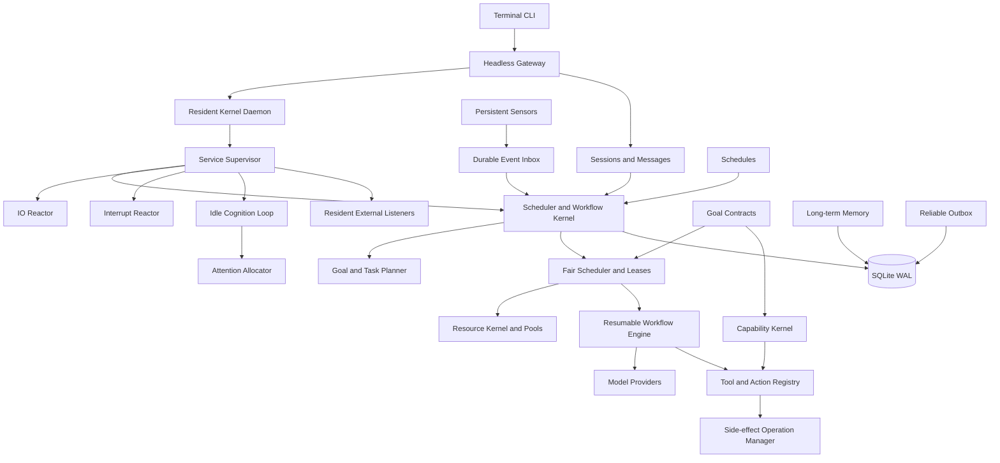
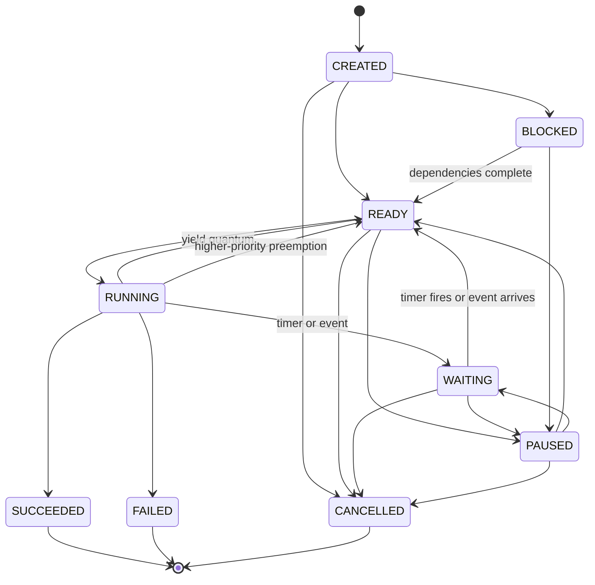
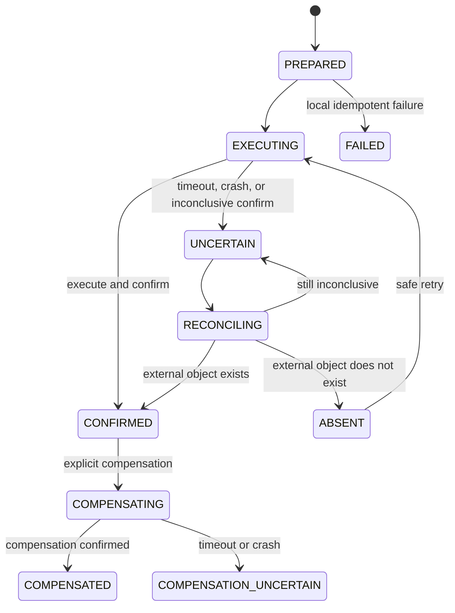
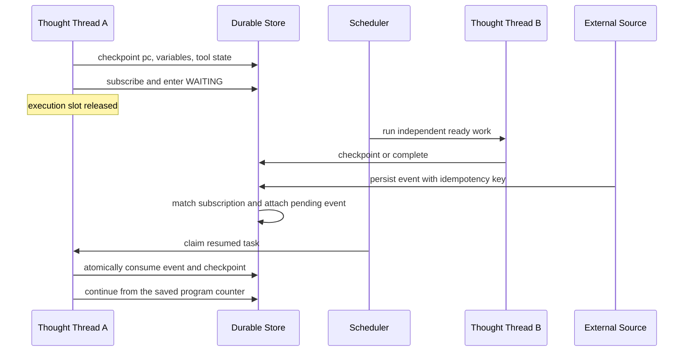

# Agent OS Architecture

## System layers

Dependencies point inward. The gateway and session layer may create goals, but they never mutate task execution state directly. Models and tools return a value or a suspension signal; only the kernel performs lifecycle transitions.

Primary code boundaries:

- `src/runtime/`: task lifecycle, planner, workflow engine, scheduler, events, and sensing
- `src/kernel/`: resident daemon, supervision, listeners, interrupts, and idle cognition
- `src/agent/`: model loop, context, tools, sessions, and long-term memory
- `src/infra/store.js`: schema, transactions, snapshots, leases, and query operations
- `src/platform/`: configuration, workspaces, channels, hooks, and plugins
- `src/cli.js` and `src/cli/`: terminal control plane
- `src/server.js`: authenticated headless gateway

## Process model: resident execution plus durable state

Agent OS uses both a real continuously running process and durable execution state. These solve different problems:

- The **Kernel Daemon** is a live Node.js host process. It keeps referenced timers, event listeners, file watchers, network ingress, and supervised service loops alive even when there are no goals.
- The **durable store** preserves tasks, waits, observations, and reasoning snapshots when that process crashes or the machine restarts.

The daemon owns six default resident services:

1. `scheduler`: ready queue, leases, timers, and task execution.
2. `io-reactor`: monitor polling, schedules, and reliable outbox delivery.
3. `interrupt-reactor`: durable priority interrupts and cooperative preemption.
4. `cognition-loop`: idle attention and optional budgeted model reflection.
5. `plan-repair-reactor`: assumption invalidation and bounded cognitive repair on durable observations.
6. `listener:workspace-inbox`: operating-system file notifications with monitor polling as a recovery fallback.

Plugins can register additional resident listeners for WebSockets, IMAP IDLE, message brokers, device streams, or other push sources. The supervisor records the host PID, generation, service heartbeat, restart count, and errors in `kernel_processes`. An expiring singleton lease prevents two live daemons from controlling the same database. `gateway start` detaches the host process from the terminal; `gateway run` keeps it in the foreground.

The supervisor restarts a resident service after an unexpected cooperative exit. It cannot recover from a completely blocked JavaScript event loop inside the same host; production isolation for untrusted or CPU-heavy listeners should use worker processes.

## Model execution principle

The LLM is a short-lived decision engine inside the persistent host process. CPU code owns listening, event matching, scheduling, persistence, retries, delivery, memory lookup, and lifecycle transitions. A model is called only when a task reaches a reasoning action. The kernel stores the serializable external reasoning state that public model APIs make available:

- goals and task dependency graphs
- program counter (`pc`) and step graph
- variables, tool results, pending tool calls, and action state
- wait conditions, deadlines, and pending events
- recent checkpoints and compact evidence
- results, failures, retry counters, controls, and audit records

The runtime does not claim to freeze a model's private chain of thought. Resume prompts are reconstructed from the goal, current step, structured variables, relevant evidence, transcript, and long-term memory. This continues from the next executable step instead of replaying the complete history.

## Persistent task lifecycle

Pause, resume, cancellation, and preemption are persistent controls. A control targeting a running task becomes a sticky intent. Long model and cooperative tool calls also receive an `AbortSignal`, so an urgent instruction can take effect without waiting for a model timeout.

## Scheduling and thought threads

Every task is an independent durable thought thread with its own workflow, snapshot, memory view, event subscription, priority, and lease. The scheduler scans a global ready queue across all goals, applies bounded concurrency, claims tasks with random lease tokens, renews leases during long calls, and yields after a bounded reasoning quantum for fairness.

A high-priority instruction creates a durable interrupt record. The interrupt reactor selects a lower-priority running thread, persists `preempt_requested`, aborts its current cooperative call, and returns the thread to `READY` without increasing its failure count. The urgent goal runs first. The preempted thread later resumes from its previous safe checkpoint with the same idempotency keys. Each goal also freezes its transcript at the inbound message that created it, preventing later messages in the same session from contaminating an older resumed thought thread.

Waiting never occupies a worker. A timer, webhook, user reply, approval, CI result, monitor observation, or another goal can resume precisely the task that subscribed to it. Unrelated ready tasks continue immediately.

Task execution is at-least-once. A tool that produces an external side effect must honor the runtime idempotency key. Lease tokens prevent an expired worker from committing over a newer owner.

## Goal contracts and resource governance

A goal, its first tasks, and its immutable execution contract are created in one database transaction. No schedulable task can exist without a contract. The contract contains:

- tenant, agent, parent goal, deadline, and capability expiry
- input-token, output-token, cost, tool-call, wall-time, and context limits
- child-goal fan-out and depth limits
- a frozen capability set
- accumulated usage, updated through an idempotent resource ledger

Root contracts can only narrow the configured system ceiling. Child contracts can only narrow their parent. The scheduler calls the Resource Kernel before claiming a ready task. A hard deadline, expired capability contract, or exhausted goal budget fails the task without retries. A daily quota defers work until the next quota window. Ready-queue ordering combines base priority, wait aging, and deadline urgency, so approaching deadlines receive increasing preference without permanently starving ordinary work.

Model calls are preflighted with an estimated input size. The provider receives the maximum output tokens still permitted by both token and cost budgets. Reported provider usage is authoritative; when a provider omits usage, conservative character-based estimates are recorded. Model price configuration is explicit because endpoint pricing is deployment-specific. Prompt construction applies the smaller of the session context ceiling and the goal context ceiling.

Tool calls are charged as logical calls with an idempotent ledger key, which prevents a wait/resume cycle from charging the same call twice. System-global and tenant-agent daily quotas cover model tokens, configured model cost, and tool calls. Resource pools independently bound default, memory, filesystem, network, browser, code, and isolated side-effect execution. Pool waits are abortable, so pause, cancel, and preemption do not strand capacity.

Goals may also declare semantic resource claims such as `account:mail:primary`, `document:release-plan`, or `order:42`. Claims are `SHARED` or `EXCLUSIVE`, persisted before the scheduler grants a task lease, and released when that execution quantum ends. Conflicting ready tasks remain durable and receive an audited retry time. Startup and lease recovery release stale claims whose task is no longer running. This coordinates business-level concurrency independently from CPU, browser, network, and code pool capacity.

The current pool manager is an in-process semaphore. It governs capacity and separates queues, but it is not a process, container, cgroup, or network namespace. Browser and code tools must name a registered sandbox adapter; the trusted adapter is responsible for crossing into a real worker, container, VM, or remote execution service.

## Capability security

Global tool allow/deny policy remains a coarse deployment guard. Per-goal authorization is capability-based and is checked on every tool execution. Capabilities express:

- exact tool names and resource pools
- workspace-relative filesystem roots and allowed operations
- network domain patterns and HTTP methods
- typed account identifiers
- data scopes
- credential reference identifiers
- declarative tool-argument allowlists and numeric limits under generic business constraints
- expiry and revocation state

Absolute paths and parent-directory escapes cannot enter a contract. Child goals cannot add tools, pools, roots, domains, methods, accounts, data scopes, credential references, business allowlist entries, or larger numeric limits that the parent did not hold. Tool descriptors bind arguments to filesystem, network, account, credential, data-scope, generic allowlist, and numeric-limit checks. This can express policies such as account, recipient pattern, message type, recipient count, and body-size limits for an email tool without hard-coding email into the kernel. Denials, freezing, credential use, expiry, and revocation enter the capability audit ledger.

Credential records contain a provider locator, not secret material. Goal snapshots, task variables, messages, contract APIs, and CLI output only contain reference identifiers. A trusted execution adapter asks the Credential Broker to resolve an active reference at the final call boundary; ownership and expiry are checked before resolution. The built-in provider currently supports environment-variable references. An in-process trusted adapter necessarily sees the resolved value during its callback, so untrusted tools must execute behind an out-of-process sandbox/secret-injection adapter.

The gateway is bound to one configured owner tenant and rejects cross-tenant request bodies and object-id lookups. Sessions, memories, goals, events, schedules, monitors, credentials, and attention records carry tenant ownership. Agent ownership is checked by capability contracts, and each configured agent has a separate workspace root. The strong tenant boundary for this personal deployment is one kernel process, database, configuration, and workspace set per tenant; shared-host, hostile multi-tenant isolation requires separate OS/container identities and is not claimed by the SQLite deployment.

External events are owner-bound. HMAC verification covers timestamp, nonce, topic, correlation key, tenant, agent, and canonical payload. The replay window rejects stale messages, and `(source, nonce)` uniqueness rejects replays after restart. Event matching includes tenant and agent ownership. Trusted internal scheduler, monitor, cognition, task, and listener events attach authenticated ownership metadata before entering the same durable inbox.

## Side-effect transaction protocol

External exactly-once execution cannot be created by a local database alone. Agent OS therefore records an explicit operation state machine for side-effecting tools:

The idempotency key is bound to the goal, task, tool, mode, and canonical request; reusing it for different input is rejected. A confirmed operation returns its stored result without executing again. A reconcilable uncertain operation queries the external system first. If a process disappears while a non-idempotent operation is `EXECUTING`, recovery changes it to `UNCERTAIN` and never blindly invokes it again. Tools with no idempotency, reconciliation, or compensation support are forced into the isolated side-effect pool and require explicit approval.

The I/O reactor periodically reconciles due operations that actually provide a reconciliation handler. Tool adapters may provide `prepare`, `confirm`, `reconcile`, and `compensate` handlers. Compensation is an explicit idempotency-keyed business action, not database rollback; an interrupted compensation remains visibly uncertain and is not blindly replayed. Assistant-message persistence and outbox insertion share one SQLite transaction, closing the local commit/send gap; delivery remains retried from the outbox. Local file and database tools use deterministic object IDs or overwrite semantics for crash-safe replay.

## Wait and resume transaction

Events are persisted before wakeup. If the event arrives first, it remains in the inbox and is consumed when the task later subscribes. If the task waits first, publishing the event changes it to `READY`. Event delivery and resume state are committed transactionally.

## Continuous sensing while idle

The host process remains alive when the ready queue is empty. Kernel and service heartbeats prove that executable loops are still resident; the persisted runtime pulse records liveness and attention counts. Monitors have their own lifecycle, interval, state, revision, lease, exponential failure backoff, observation ledger, and sensor implementation.

Built-in sensors currently include:

- `workspace_inbox`: detects newly added files in an agent workspace inbox
- `https`: detects content changes in a public HTTPS text resource

A changed observation produces a durable `monitor.changed` event. A monitor may also create a new session goal automatically, which lets the agent perceive a change and decide what to do without an active user request. Resident listeners provide immediate push wakeups; monitors provide durable comparison state and polling recovery. Plugins can register both.

The cognition loop is always resident but conservative by default. It observes idle periods without calling a model. Before any reflection, the Attention Allocator scores deadline risk, failure/preemption drift, new monitor observations, account or explicit goal conflicts, and long-blocked work. It calculates an expected value from that score and compares it with configured model cost. A reflection goal is created only when the score, value test, cooldown, model availability, and daily budget all permit it. Reflection goals receive their own short deadline, small budget, and read-only capabilities. Critical assessments can raise a durable interrupt so attention scheduling participates in normal preemption.

## Sessions, memory, approvals, and delivery

Sessions store routing and conversation context but do not own execution lifetimes. Each inbound message is deduplicated by message id and compiled into a persistent goal containing memory recall, agent turn, and reliable delivery tasks.

Conversation history and long-term memory are separate retention domains. In explicit capture mode, ordinary prompts remain only in their session and the model is instructed to create long-term memory only after an explicit user request. Long-term memory is stored in SQLite, searched with FTS5, mirrored to Markdown daily notes with stable record ids, and selectively recalled into prompts. Each record carries source, confidence, validity interval, provenance, confirmation time, and optional supersession or contradiction links. Retrieval excludes expired, retracted, superseded, and contradicted beliefs. A memory deletion removes both the database record and its diary mirror.

## Plan versions, assumptions, and cognitive repair

Every goal begins with a durable plan version. The planner or model can record explicit assumptions with a statement, confidence, evidence, and a watch condition containing an event topic plus optional correlation key and source. The resident Plan Repair Service observes the same durable event stream as the scheduler. A matching observation atomically invalidates the assumption and marks the current plan stale.

Invalidation creates a child repair goal rather than restarting the parent. Its deadline, token, cost, tool, context, fan-out, and depth budgets are bounded by the parent contract. Its capability set is attenuated to read-only inspection and plan recording, with no account or credential authority. Successful repair creates a new current plan version and injects a versioned `cognitive-update` into non-running parent snapshots, including a suspended model tool state. When the original external wait completes, the next model request receives the repair result while retaining its prior program counter, tool call, variables, evidence, and completed side effects.

This is bounded cognitive plan repair, not arbitrary graph rewriting. The current kernel preserves existing task topology and asks the resumed reasoning step to apply the revision. Production evolution still needs dependency impact analysis and transactional insertion, replacement, or cancellation of pending DAG nodes.

A session purge is allowed only after all of its goals are terminal. It deletes messages, completed goal graphs, audit-linked execution records, interrupts, and delivery outbox rows. Schedules that referenced the deleted session are detached and will create a new session on their next run. Long-term memories are intentionally preserved because they have an independent lifecycle. Starting a new terminal thread changes the context boundary without deleting either domain.

High-risk tools create durable approval records and suspend on `approval.resolved`. Responses are first written to the session and then placed in an outbox with retry and idempotency semantics.

## Operator terminal and onboarding

The first-run wizard configures agent identity, workspace, gateway exposure, model provider, credential source, resource profile, background cognition, and approval policy. Runtime-resolved model keys and gateway tokens are removed from the serialized configuration. The configuration and separate local secret file are written atomically with owner-only permissions. A non-loopback gateway receives a generated bearer token reference.

The interactive terminal is an operator surface, not the owner of task execution. Its fixed dashboard polls a single snapshot endpoint and displays kernel liveness, thought-thread states, goals, memory/session counts, attention decisions, and resource-pool pressure while the scrolling region remains interactive. Background submissions return immediately to the prompt; exiting the terminal restores the screen and leaves the resident gateway and durable goals running.

The terminal implements a one-cockpit/many-thread attention model. Typing `/` opens a cursor-anchored dropdown below the input line without replacing the operational dashboard. It supports incremental filtering, Up/Down selection, PageUp/PageDown paging, Tab/Enter selection, and Escape dismissal. `/task` creates parallel goals, `/focus` binds follow-up work to a parent goal, `/inbox` aggregates user-input waits and approvals, `/reply` publishes the exact correlation event, and `/interrupt` enters the durable preemption path. A focused goal or a session with exactly one user-input wait receives natural-language input as a deterministic resume event. Multiple candidate waits are never guessed; the operator must select one.

`/model` combines provider discovery with a searchable terminal picker. The Gateway queries the OpenAI-compatible `/models` catalog with its referenced credential and returns only model identifiers, never the secret. The picker also exposes focused add-provider flows for OpenAI, OpenRouter, DeepSeek, custom endpoints, and offline mode; these append a named configuration, preserve unrelated OS policy, and reload the Gateway. The durable session preference stores both the base configuration key and concrete model id, and both values are copied into each goal at creation. Agent turns resolve the goal-frozen selection before mutable session state, so a suspended task resumes with the same model even if the operator switches the session while it is waiting. Autonomous child goals inherit their parent's frozen selection unless an explicit operator selection is supplied.

This routing layer is deliberately CPU-first. Database ownership, session identity, wait topics, correlation keys, and explicit focus are sufficient for deterministic routing. A model is reserved for semantic planning and other cognitive decisions, not for lifecycle transitions that the kernel can prove from state.

## Explainable task management

The Observability Kernel builds operator explanations entirely from durable runtime facts. A thread view combines lifecycle state, the latest audit cause, dependency state, program counter, checkpoint revision, event/timer wait identity, lease ownership, preemption audit, resource usage and budget, and the frozen capability contract. `/manager`, `/inspect`, and `/trace` expose these projections without spending model tokens. Operator controls for pause, resume, cancel, priority revision, budget revision, and capability revocation append audit events and preserve safe-checkpoint semantics.

Agent turns attach hashed evidence records for recalled memories and tool results. Goal tracing connects the final response to the evidence set available during execution and labels this relationship as `execution-context`. This is intentionally weaker than claim-level provenance: proving which assertion follows from which source requires structured citations and entailment tracking, which remains future work.

## Resident inbound channels

Inbound channel waiting is a three-layer mechanism, not a long-lived model request:

1. A supervised channel adapter owns the external connection. Its `listen({ signal, heartbeat, ingest })` loop can implement IMAP IDLE, WebSocket, queue consumption, or another push protocol. The Kernel Supervisor monitors and restarts this resident service.
2. `ChannelRegistry.ingest()` normalizes the provider message and writes a unique `channel_messages` record keyed by channel, account, and external message id. It then publishes a tenant- and agent-owned `channel.message` durable event. Pending message records are reconciled by the I/O reactor after a crash.
3. `wait_for_channel` checkpoints the current model tool state and subscribes with a deterministic correlation key derived from channel, account, and external thread. The task enters `WAITING`, releases its worker, and resumes only when the exact event arrives.

The event may arrive before or after the subscription. Existing durable-event matching handles both orderings. Duplicate provider delivery returns the existing channel-message record and cannot publish a second logical event. Once resumed, a new model call receives the normalized message as tool output and decides the next action from the saved external reasoning state.

## Persistence and recovery

SQLite is the local source of truth and runs in WAL mode. Durable entities include agents, sessions, messages, goals, goal contracts, plan versions, goal assumptions, semantic resource claims, resource ledgers, capability audits, credential references, tasks, events, event deliveries, memories, approvals, schedules, monitors, observations, side-effect operations, attention assessments, interrupts, kernel processes, the kernel ownership lease, outbox entries, system state, and an append-only audit log.

At startup, the daemon acquires the singleton lease, marks processes from a crashed generation as orphaned, recovers running tasks and expired monitor leases, and starts a new supervised generation. Waiting tasks keep their exact wait condition and snapshot across restarts. Terminal CLI clients may disconnect without affecting the detached daemon or goal execution.

## Production boundaries and evolution

The current deployment unit is one gateway with SQLite. A multi-node version can preserve the domain model while replacing infrastructure:

1. Use a shared database with row locking or compare-and-swap.
2. Add monotonic fencing tokens to worker and monitor claims.
3. Publish state changes through a transactional outbox and message broker.
4. Replace in-process pool adapters with separately authenticated worker services, containers, or VMs.
5. Integrate a dedicated secret manager that injects credentials directly into isolated workers.
6. Add cryptographic audit chaining and immutable archival.
7. Compact old evidence into traceable summaries while retaining raw output references.

## Security invariants

- Planners can select only registered actions and tools.
- Goal capabilities are immutable; child authority is monotonically decreasing.
- External events require authentication by default, replay protection, and tenant/agent ownership checks.
- Snapshots store secret references, never secret values.
- Non-idempotent `EXECUTING` operations recover to `UNCERTAIN`, never automatic replay.
- High-risk actions are unlocked through explicit approval events.
- Audit records are append-only; production deployments may add hash chaining or immutable archival.
- HTTP sensors reject non-HTTPS URLs, private addresses, redirects, and non-text responses.
