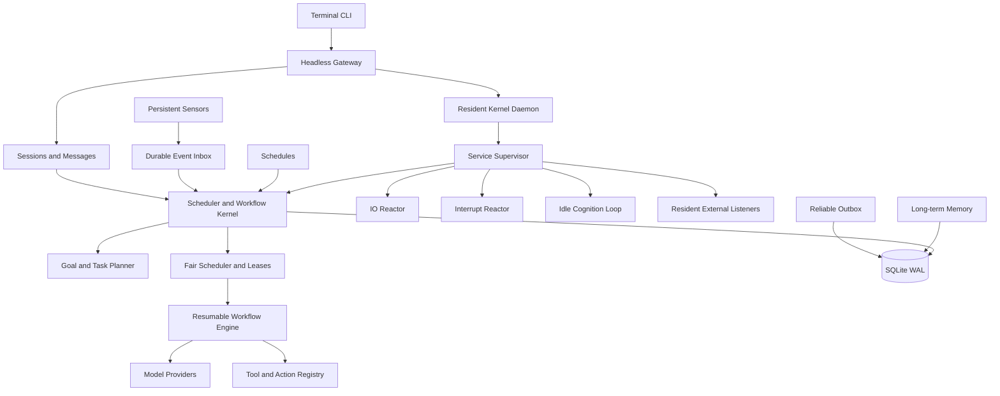
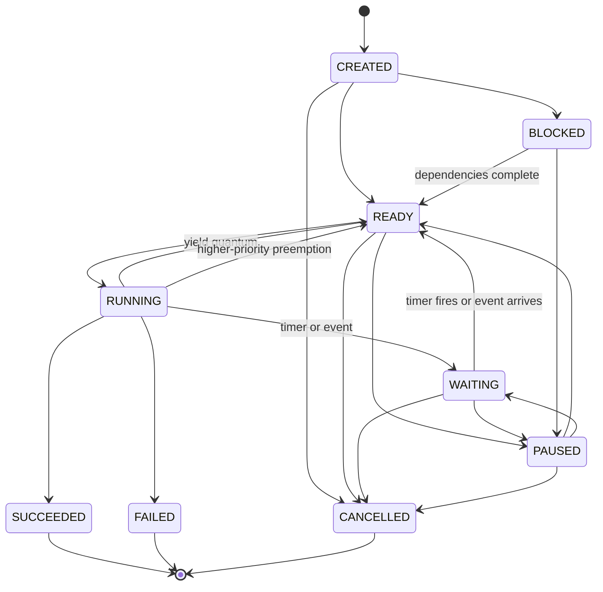
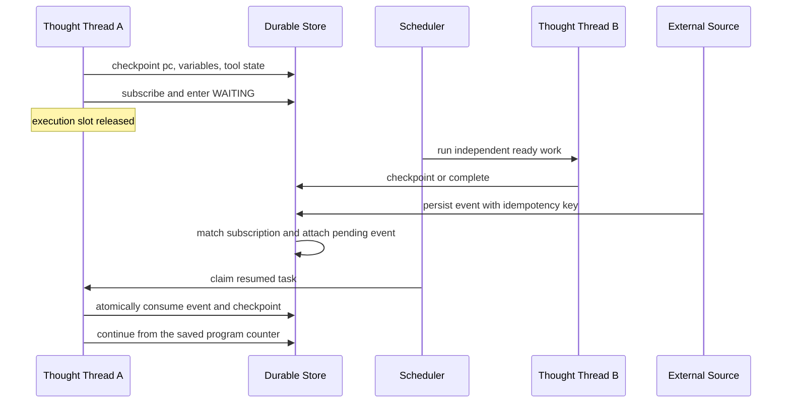

# Agent OS Architecture

## System layers

Dependencies point inward. The gateway and session layer may create goals, but they never mutate task execution state directly. Models and tools return a value or a suspension signal; only the kernel performs lifecycle transitions.

Primary code boundaries:

- `src/runtime/`: task lifecycle, planner, workflow engine, scheduler, events, and sensing
- `src/kernel/`: resident daemon, supervision, listeners, interrupts, and idle cognition
- `src/agent/`: model loop, context, tools, sessions, and long-term memory
- `src/infra/store.js`: schema, transactions, snapshots, leases, and query operations
- `src/platform/`: configuration, workspaces, channels, hooks, and plugins
- `src/cli.js` and `src/cli/`: terminal control plane
- `src/server.js`: authenticated headless gateway

## Process model: resident execution plus durable state

Agent OS uses both a real continuously running process and durable execution state. These solve different problems:

- The **Kernel Daemon** is a live Node.js host process. It keeps referenced timers, event listeners, file watchers, network ingress, and supervised service loops alive even when there are no goals.
- The **durable store** preserves tasks, waits, observations, and reasoning snapshots when that process crashes or the machine restarts.

The daemon owns five default resident services:

1. `scheduler`: ready queue, leases, timers, and task execution.
2. `io-reactor`: monitor polling, schedules, and reliable outbox delivery.
3. `interrupt-reactor`: durable priority interrupts and cooperative preemption.
4. `cognition-loop`: idle attention and optional budgeted model reflection.
5. `listener:workspace-inbox`: operating-system file notifications with monitor polling as a recovery fallback.

Plugins can register additional resident listeners for WebSockets, IMAP IDLE, message brokers, device streams, or other push sources. The supervisor records the host PID, generation, service heartbeat, restart count, and errors in `kernel_processes`. An expiring singleton lease prevents two live daemons from controlling the same database. `gateway start` detaches the host process from the terminal; `gateway run` keeps it in the foreground.

The supervisor restarts a resident service after an unexpected cooperative exit. It cannot recover from a completely blocked JavaScript event loop inside the same host; production isolation for untrusted or CPU-heavy listeners should use worker processes.

## Model execution principle

The LLM is a short-lived decision engine inside the persistent host process. CPU code owns listening, event matching, scheduling, persistence, retries, delivery, memory lookup, and lifecycle transitions. A model is called only when a task reaches a reasoning action. The kernel stores the serializable external reasoning state that public model APIs make available:

- goals and task dependency graphs
- program counter (`pc`) and step graph
- variables, tool results, pending tool calls, and action state
- wait conditions, deadlines, and pending events
- recent checkpoints and compact evidence
- results, failures, retry counters, controls, and audit records

The runtime does not claim to freeze a model's private chain of thought. Resume prompts are reconstructed from the goal, current step, structured variables, relevant evidence, transcript, and long-term memory. This continues from the next executable step instead of replaying the complete history.

## Persistent task lifecycle

Pause, resume, cancellation, and preemption are persistent controls. A control targeting a running task becomes a sticky intent. Long model and cooperative tool calls also receive an `AbortSignal`, so an urgent instruction can take effect without waiting for a model timeout.

## Scheduling and thought threads

Every task is an independent durable thought thread with its own workflow, snapshot, memory view, event subscription, priority, and lease. The scheduler scans a global ready queue across all goals, applies bounded concurrency, claims tasks with random lease tokens, renews leases during long calls, and yields after a bounded reasoning quantum for fairness.

A high-priority instruction creates a durable interrupt record. The interrupt reactor selects a lower-priority running thread, persists `preempt_requested`, aborts its current cooperative call, and returns the thread to `READY` without increasing its failure count. The urgent goal runs first. The preempted thread later resumes from its previous safe checkpoint with the same idempotency keys. Each goal also freezes its transcript at the inbound message that created it, preventing later messages in the same session from contaminating an older resumed thought thread.

Waiting never occupies a worker. A timer, webhook, user reply, approval, CI result, monitor observation, or another goal can resume precisely the task that subscribed to it. Unrelated ready tasks continue immediately.

Task execution is at-least-once. A tool that produces an external side effect must honor the runtime idempotency key. Lease tokens prevent an expired worker from committing over a newer owner.

## Wait and resume transaction

Events are persisted before wakeup. If the event arrives first, it remains in the inbox and is consumed when the task later subscribes. If the task waits first, publishing the event changes it to `READY`. Event delivery and resume state are committed transactionally.

## Continuous sensing while idle

The host process remains alive when the ready queue is empty. Kernel and service heartbeats prove that executable loops are still resident; the persisted runtime pulse records liveness and attention counts. Monitors have their own lifecycle, interval, state, revision, lease, exponential failure backoff, observation ledger, and sensor implementation.

Built-in sensors currently include:

- `workspace_inbox`: detects newly added files in an agent workspace inbox
- `https`: detects content changes in a public HTTPS text resource

A changed observation produces a durable `monitor.changed` event. A monitor may also create a new session goal automatically, which lets the agent perceive a change and decide what to do without an active user request. Resident listeners provide immediate push wakeups; monitors provide durable comparison state and polling recovery. Plugins can register both.

The cognition loop is always resident but conservative by default. It observes idle periods without calling a model. `autoReflect` can be enabled explicitly to create bounded reflection goals. Idle delay, cooldown, model availability, and a daily goal budget prevent uncontrolled self-triggering.

## Sessions, memory, approvals, and delivery

Sessions store routing and conversation context but do not own execution lifetimes. Each inbound message is deduplicated by message id and compiled into a persistent goal containing memory recall, agent turn, and reliable delivery tasks.

Long-term memory is stored in SQLite, searched with FTS5, mirrored to Markdown daily notes, and selectively recalled into prompts. High-risk tools create durable approval records and suspend on `approval.resolved`. Responses are first written to the session and then placed in an outbox with retry and idempotency semantics.

## Persistence and recovery

SQLite is the local source of truth and runs in WAL mode. Durable entities include agents, sessions, messages, goals, tasks, events, event deliveries, memories, approvals, schedules, monitors, observations, interrupts, kernel processes, the kernel ownership lease, outbox entries, system state, and an append-only audit log.

At startup, the daemon acquires the singleton lease, marks processes from a crashed generation as orphaned, recovers running tasks and expired monitor leases, and starts a new supervised generation. Waiting tasks keep their exact wait condition and snapshot across restarts. Terminal CLI clients may disconnect without affecting the detached daemon or goal execution.

## Production evolution

The current deployment unit is one gateway with SQLite. A multi-node version can preserve the domain model while replacing infrastructure:

1. Use a shared database with row locking or compare-and-swap.
2. Add monotonic fencing tokens to worker and monitor claims.
3. Publish state changes through a transactional outbox and message broker.
4. Persist and authenticate webhook ingress before acknowledging it.
5. Isolate model, browser, code, email, and payment workers in separate pools.
6. Enforce per-goal cost, fan-out, deadline, resource, and permission budgets.
7. Compact old evidence into traceable summaries while retaining raw output references.

## Security invariants

- Planners can select only registered actions and tools.
- External events require authentication, replay protection, and ownership checks in multi-user deployments.
- Snapshots store secret references, never secret values.
- High-risk actions are unlocked through explicit approval events.
- Audit records are append-only; production deployments may add hash chaining or immutable archival.
- HTTP sensors reject non-HTTPS URLs, private addresses, redirects, and non-text responses.
